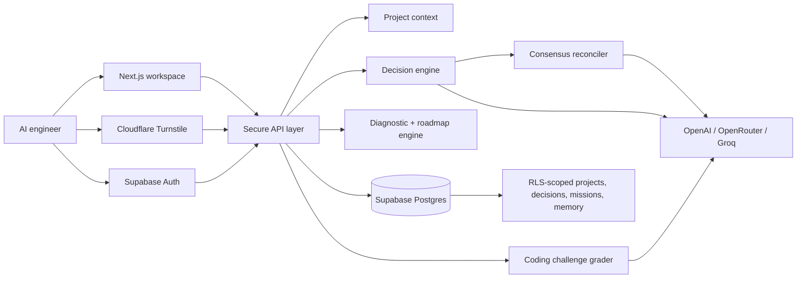

# GenPHD

### Decision intelligence for AI engineers

**GenPHD turns a scattered technical question into one evidence-backed next move — then remembers what the project learned.**

[Open the live product](https://genphd.onrender.com) · [See the product requirements](docs/01-product-requirements.md) · [Read the architecture](docs/03-system-design.md)

---

## Why GenPHD

AI engineers rarely lack advice. They lack a reliable way to decide **what to trust, what to build next, and what evidence to carry forward**.

GenPHD is not another chat window or a generic dashboard. It is a private workspace that connects:

1. **Project context** — outcome, stack, constraints, time, and blocker.
2. **Decision intelligence** — an evidence-aware brief with trade-offs, conflicts, and a bounded next action.
3. **Deliberate practice** — a roadmap, build mission, and coding challenge that turn advice into proof of capability.
4. **Learning memory** — a traceable record that improves the next decision instead of rewarding streaks.

> **One question → one trusted recommendation → one buildable mission → durable learning evidence.**

## Product loop

| Step | What the engineer does | What GenPHD delivers |
| --- | --- | --- |
| 1. Frame the work | Describe the project, stack, available time, and current blocker. | A private project context. |
| 2. Diagnose the gap | Take a short adaptive baseline across six GenAI competencies. | A skill-gap vector and prerequisite-aware roadmap. |
| 3. Ask a decision | Ask a real question such as *“Should I use pgvector or Pinecone for this RAG project?”* | A Decision Brief with evidence, trade-offs, conflicts, confidence, and a next move. |
| 4. Compare perspectives | Request consensus for higher-stakes choices. | Multi-model agreements, disagreements, and one reconciled next step. |
| 5. Build proof | Complete a focused mission or practical coding challenge. | Recorded completion and competency evidence. |
| 6. Continue with context | Return to the dashboard, roadmap, or memory. | A workspace that remembers what changed and why. |

## What makes it different

| Capability | GenPHD approach |
| --- | --- |
| Decision support | Structured briefs, not unbounded chatbot replies. Every recommendation exposes its evidence and trade-off. |
| Personalization | Roadmaps are shaped by project constraints and diagnostic gaps, not a fixed course sequence. |
| Multi-model consensus | Configured models are fanned out and reconciled into agreements, conflicts, and a trusted next step. |
| Skill evidence | Progress is tied to missions and practical work, not engagement metrics or streaks. |
| Memory | Project context, decisions, and evidence remain visible and scoped to the active workspace. |
| Safe fallback | AI flows degrade from multi-model → single model → deterministic guidance when a provider is unavailable. |

## Architecture



### Trust boundary

- **Supabase Auth** verifies sessions on the server; workspace routes are not available before authentication.
- **Row Level Security** scopes projects, decisions, roadmaps, missions, diagnostic runs, and memory to the signed-in user.
- **Cloudflare Turnstile** protects sign-up and sign-in; its secret stays in Supabase Auth, never in this repository.
- **Provider keys are server-only.** The browser never receives OpenAI, OpenRouter, or Groq credentials.
- **AI output is schema-validated** before being shown or persisted. Invalid provider responses fall back safely.

## GPT-5.6 integration

GenPHD uses a server-only, OpenAI-compatible provider boundary rather than calling a model from the browser.

- When `OPENAI_API_KEY` is configured, Decision Brief generation can use **GPT-5.6** through `OPENAI_MODEL` (the project default is `gpt-5.6-sol`).
- GPT-5.6 receives the project question and bounded project context, then returns a **strict JSON Decision Brief**: recommendation, summary, confidence reason, trade-off, counterfactual, sources, conflicts, and a next action.
- The response is parsed with Zod before it reaches the UI or database. A malformed or unavailable response falls through the configured provider order, then to deterministic guidance so the workspace remains usable.
- The dedicated consensus action fans a question out to multiple configured models, reconciles agreements and conflicts, and returns one trusted next step. It is user-triggered rather than silently run, so model cost stays explicit.
- The same server-side provider pattern supports content drafting and optional correctness-aware challenge grading. Provider keys never enter the client bundle.

Set `OPENAI_API_KEY` and optionally `OPENAI_MODEL` in `.env.local` or Render to enable GPT-5.6. See [`lib/decision/provider.ts`](lib/decision/provider.ts) for the typed fallback chain.

## Key product and engineering decisions

| Decision | Why it matters |
| --- | --- |
| Structured Decision Briefs instead of chat | Engineers need visible evidence, trade-offs, conflicts, and a next action—not a stream of untraceable answers. |
| One active project context | Keeps every recommendation grounded in current constraints and prevents a generic “AI advisor” experience. |
| Diagnostic-led roadmap | Skills are inferred from evidence and prerequisite gaps, rather than forcing every user through the same curriculum. |
| Explicit multi-model consensus | Higher-stakes questions can surface agreement and disagreement without charging for fan-out on every routine request. |
| Supabase RLS + server-verified sessions | Private project intelligence is user-scoped at the database and API layers. |
| Provider validation and deterministic fallback | The product continues to provide a coherent, safe response when a model or provider is unavailable. |
| Next.js monolith for the hackathon | Keeps deployment, auth, data access, and iteration fast without pretending microservices are necessary at this stage. |

## How Codex accelerated the build

Codex was used as an implementation partner throughout the project, while product and security choices remained deliberate human decisions.

- It translated the PRD, UI blueprint, and system design into the Next.js workspace structure, typed contracts, and API routes.
- It accelerated UI iteration across the landing experience, protected authentication flow, dashboard, navigation, and responsive states.
- It helped implement and verify typed provider fallbacks, multi-model consensus, diagnostic scoring, roadmap generation, coding challenge grading, and Supabase persistence boundaries.
- It supported production readiness work: resolving merge conflicts, keeping the Docker deployment compact, running TypeScript/tests/production builds, and checking authentication and security flows.
- Human review directed the core product identity: evidence over noise, project-scoped memory, explicit consent for model fan-out, and a calm non-dashboard-template interface.

## Judge test plan

The full product can be tested with your own project. No proprietary dataset is required.

### Sample project input

Use this during onboarding for a representative end-to-end evaluation:

| Field | Sample value |
| --- | --- |
| Project name | `DocuQuery` |
| Outcome | A source-grounded document assistant that makes retrieval quality visible. |
| Stack | `Python`, `FastAPI`, `pgvector` |
| Time available | `6 hours this week` |
| Current blocker | Deciding which evaluation work proves retrieval is reliable enough to ship. |

### Manual product checks

1. Visit the [live app](https://genphd.onrender.com) and choose **Start one project**.
2. Create an account, complete email verification, and sign in through the Supabase + Turnstile protected flow.
3. Enter the sample project above. Confirm that onboarding creates a project and an ordered roadmap.
4. Run the diagnostic, or select **Skip for now** to inspect the starter path.
5. From **Dashboard**, ask: **“Should I use pgvector or Pinecone for this RAG project?”** Review the Decision Brief’s recommendation, evidence, trade-off, confidence, and next action.
6. In **Decisions**, use the consensus option. When live provider keys are configured, inspect model agreements/conflicts; otherwise verify the clearly labelled deterministic fallback.
7. Open **My roadmap**, start a Build Mission, and complete it. Confirm that progress and learning evidence update.
8. Open **Coding challenges**, submit a solution, and inspect criterion-based feedback. With an AI provider key, the grader adds correctness-aware feedback; without one it uses the disclosed heuristic fallback.
9. Open **Learning memory** to confirm the project context and decision history remain visible and scoped to the workspace.

### Automated checks

```powershell
npm run typecheck
npm test
npm run build
```

## Workspace surfaces

| Surface | Purpose |
| --- | --- |
| Dashboard | Answers: **“What should I do today?”** |
| My roadmap | Answers: **“What should I learn next?”** |
| Decisions | Answers: **“What should I trust?”** |
| My project | Keeps scope, stack, time, and constraints visible. |
| Build missions | Turns a decision into a small, testable action. |
| Coding challenges | Lets users submit practical code and receive criterion-based grading. |
| Progress | Records meaningful work, not activity noise. |
| Learning memory | Shows the context and evidence shaping future decisions. |

## Tech stack

- **Frontend:** Next.js 16, React, TypeScript, CSS
- **Authentication and database:** Supabase Auth + Postgres + Row Level Security
- **AI orchestration:** typed provider boundary for OpenAI, OpenRouter, and Groq
- **Bot protection:** Cloudflare Turnstile with server-validated Supabase sessions
- **Validation:** Zod schemas, unit tests, typed API contracts
- **Deployment:** compact multi-stage Docker image on Render

## Run locally

### Prerequisites

- Node.js 22+
- A Supabase project for private workspaces
- A Cloudflare Turnstile widget for authentication protection
- At least one AI provider key for live AI generation (OpenAI, OpenRouter, or Groq)

```powershell
git clone https://github.com/ankitpt2005/GenPHD.git
cd GenPHD
npm ci
Copy-Item .env.example .env.local
npm run dev
```

Open [http://localhost:3000](http://localhost:3000).

### Required configuration

Set the following values in `.env.local`:

| Variable | Purpose |
| --- | --- |
| `NEXT_PUBLIC_SUPABASE_URL` | Supabase project URL |
| `NEXT_PUBLIC_SUPABASE_PUBLISHABLE_KEY` | Public browser key from Supabase |
| `NEXT_PUBLIC_TURNSTILE_SITE_KEY` | Public Cloudflare Turnstile widget key |
| `NEXT_PUBLIC_SITE_URL` | Local or deployed application URL |
| `OPENAI_API_KEY`, `OPENROUTER_API_KEY`, or `GROQ_API_KEY` | At least one server-only AI provider key |

Never commit `.env.local`, provider keys, database passwords, or Turnstile secrets.

### Database setup

1. Create a Supabase project and enable **Email/password** authentication.
2. Add `http://localhost:3000/auth/callback` to Supabase Auth redirect URLs.
3. Apply the migrations in [`supabase/migrations`](supabase/migrations) in numeric order.
4. Run [`supabase/seed.sql`](supabase/seed.sql) to load the competency and source catalog.
5. Enable Cloudflare Turnstile in **Supabase Auth → Bot and Abuse Protection**. Store the matching Turnstile secret there, not in application code.

### Included sample data

[`supabase/seed.sql`](supabase/seed.sql) supplies the shared catalog used by the product: six GenAI competencies (prompting, embeddings, vector databases, retrieval, agent frameworks, and evaluations) plus official source references for LangGraph and OpenAI evaluation guidance.

It intentionally **does not** create fake user accounts or private projects. Use the [sample project input](#sample-project-input) in the judge test plan to create a real workspace and exercise the product loop.

`GENPHD_ALLOW_DEMO_MODE` is deliberately `false` by default. It can be enabled only for local, non-production exploration without Supabase.

## API highlights

| Endpoint | Responsibility |
| --- | --- |
| `POST /api/onboarding` | Validates and creates project context + initial roadmap. |
| `GET/POST /api/diagnostic` | Serves adaptive questions and persists the skill-gap result. |
| `POST /api/decisions` | Produces a validated, source-aware Decision Brief. |
| `POST /api/consensus` | Reconciles multiple model perspectives into one decision report. |
| `GET /api/challenges` | Returns a competency-relevant coding challenge without grading keys. |
| `POST /api/challenges/grade` | Grades a submitted solution and records evidence on a pass. |
| `POST /api/missions/complete` | Records a completed mission and updates learning evidence. |
| `GET /api/memory` | Returns the visible, project-scoped memory used by the workspace. |
| `GET /api/health` | Deployment health check. |

## Deployment

The repository includes [`render.yaml`](render.yaml) and a small multi-stage [`Dockerfile`](Dockerfile). Render builds the standalone Next.js server and only ships traced production assets—never local `.env`, `.next`, or `node_modules`.

For a production deploy, set the Supabase public values, Turnstile site key, public site URL, and server-only provider keys in Render. Keep `GENPHD_ALLOW_DEMO_MODE=false`, then add the deployed `/auth/callback` URL to Supabase Auth redirect URLs.

---

Built for engineers who want a clearer next move—not another tab full of advice.
